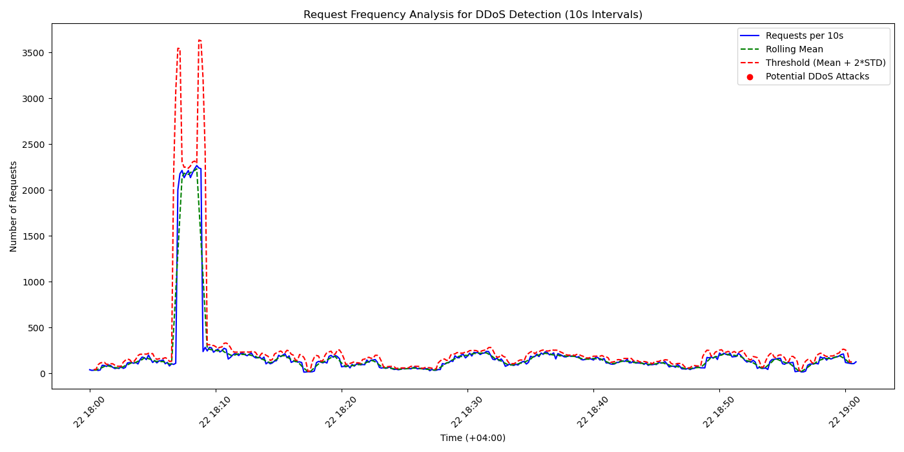

# DDoS Attack Detection from Server Log / DDoS შეტევის გამოვლენა სერვერის ლოგიდან

This project analyzes a server log file to detect potential DDoS attack times using Python. The script processes the log, identifies request spikes, and visualizes the results. / ეს პროექტი აანალიზებს სერვერის ლოგ ფაილს DDoS შეტევის დროის გამოსავლენად Python-ის გამოყენებით. სკრიპტი ამუშავებს ლოგს, გამოავლენს მოთხოვნების მკვეთრ ზრდას და ვიზუალიზაციას ახდენს შედეგების.

## Log File / ლოგ ფაილი
- **Link to Log File / ლოგ ფაილის ბმული**: [luka_babunadze_1_server.log](https://github.com/LukaBabunadze/ml-25-ddos-detection/blob/main/luka_babunadze_1_server.log)
- **DDoS Attack Time / DDoS შეტევის დრო**: Max requests: 2268 at 2024-03-22 18:08:30+04:00

## Visualization / ვიზუალიზაცია
### Request Frequency Plot / მოთხოვნების სიხშირის გრაფიკი


This plot shows requests per 10-second intervals, rolling mean, threshold, and detected DDoS attack times. / ეს გრაფიკი აჩვენებს მოთხოვნებს 10-წამიანი ინტერვალებით, მოძრავ საშუალოს, ზღვარს და გამოვლენილ DDoS შეტევის დროებს.

## How to Run the Code / კოდის გაშვების ინსტრუქცია
### English
1. Clone the repository: `git clone https://github.com/LukaBabunadze/ml-25-ddos-detection.git`
2. Install dependencies: `pip install pandas matplotlib scikit-learn`
3. Save the log file as `luka_babunadze_1_server.log` in the repository folder.
4. Run the script: `python ddos_detection.py`
5. Check the output for detected DDoS times and view the generated plots (`ddos_detection_plot.png` and `regression_analysis_plot.png`).

### ქართული
1. გადმოწერეთ რეპოზიტორია: `git clone https://github.com/LukaBabunadze/ml-25-ddos-detection.git`
2. დააინსტალირეთ: `pip install pandas matplotlib scikit-learn`
3. შეინახეთ ლოგ ფაილი სახელით `luka_babunadze_1_server.log` რეპოზიტორიის საქაღალდეში.
4. გაუშვით სკრიპტი: `python ddos_detection.py`
5. შეამოწმეთ გამომავალი DDoS დროებისთვის და ნახეთ გენერირებული გრაფიკები (`ddos_detection_plot.png` და `regression_analysis_plot.png`).

## Key Code Fragments and Explanations / ძირითადი კოდის ფრაგმენტები და ახსნა

### 1. Timestamp Parsing / დროის ანალიზი
```python
def parse_log_line(line):
    pattern = r'\[(.*?)\]'
    match = re.search(pattern, line)
    if match:
        timestamp_str = match.group(1)
        timestamp = datetime.strptime(timestamp_str, '%Y-%m-%d %H:%M:%S%z')
        return timestamp
```
**Explanation / ახსნა**: Uses regex (`r'\[(.*?)\]'`) to extract timestamps (e.g., `2024-03-22 18:08:30+04:00`) from log lines and converts them to datetime objects with timezone support. 
**/ იყენებს regex-ს დროის ამოსაღებად ლოგის ხაზებიდან და გარდაქმნის datetime ობიექტად დროის ზონის მხარდაჭერით.**

---

### 2. Grouping and Counting Requests / მოთხოვნების დაჯგუფება
```python
df['interval'] = df['timestamp'].dt.floor('10s')
request_counts = df.groupby('interval').size().reset_index(name='count')
```
**Explanation / ახსნა**: Groups timestamps into 10-second intervals and counts requests per interval to detect short-term spikes typical of DDoS attacks. 
**/ ჯგუფავს დროებს 10-წამიან ინტერვალებად და ითვლის მოთხოვნებს თითო ინტერვალში DDoS-ისთვის დამახასიათებელი მოკლევადიანი ზრდის გამოსავლენად.**

---

### 3. Anomaly Detection / ანომალიის გამოვლენა
```python
request_counts['rolling_mean'] = request_counts['count'].rolling(window=5, center=True).mean()
request_counts['rolling_std'] = request_counts['count'].rolling(window=5, center=True).std()
request_counts['threshold'] = request_counts['rolling_mean'] + 2 * request_counts['rolling_std']
ddos_candidates = request_counts[request_counts['count'] > request_counts['threshold']]
```
**Explanation / ახსნა**: Calculates a rolling mean and standard deviation over 5 intervals (~50 seconds). Sets a threshold (mean + 2std) to identify anomalies (e.g., 2268 requests at 18:08:30). 
**/ ითვლის მოძრავ საშუალოს და სტანდარტულ გადახრას 5 ინტერვალზე (~50 წმ). ადგენს ზღვარს (საშუალო + 2გადახრა) ანომალიების გამოსავლენად.**

---

### 4. Visualization / ვიზუალიზაცია
```python
plt.plot(request_counts['interval'], request_counts['count'], label='Requests per 10s', color='blue')
plt.scatter(ddos_candidates['interval'], ddos_candidates['count'], color='red', label='Potential DDoS Attacks', zorder=5)
plt.savefig('ddos_detection_plot.png')
```
**Explanation / ახსნა**: Plots requests over time with Matplotlib, highlighting DDoS candidates in red. Saves the chart as `ddos_detection_plot.png`. 
**/ ხაზავს მოთხოვნებს დროის მიხედვით Matplotlib-ით, DDoS კანდიდატებს წითლად აღნიშნავს და ინახავს გრაფიკს.**

---

## Methods and Techniques / მეთოდები და ტექნიკები

- **DDoS Detection / DDoS-ის გამოვლენა**
- **Statistical Analysis / სტატისტიკური ანალიზი**: Uses rolling mean and standard deviation to detect outliers (spikes) in request frequency, a common DDoS indicator. The peak at 18:08:30 with 2268 requests exceeds the threshold, marking it as the attack time. / იყენებს მოძრავ საშუალოს და გადახრას მოთხოვნების სიხშირის ანომალიების გამოსავლენად, რაც DDoS-ის მაჩვენებელია.
- **Time Window / დროის ფანჯარა**: 10-second intervals provide granularity to catch short bursts of traffic. / 10-წამიანი ინტერვალები იძლევა სიზუსტეს მოკლე ტრაფიკის ზრდის დასაფიქსირებლად.
- **Chart Building / გრაფიკის აგება**
- **Matplotlib / Matplotlib-ის გამოყენება**: Plots request counts, mean, threshold, and anomalies on a time-series graph for clear visualization. Custom styling (colors, labels) enhances readability. / ხაზავს მოთხოვნების რაოდენობას, საშუალოს, ზღვარს და ანომალიებს დროის სერიების გრაფიკზე ნათელი ვიზუალიზაციისთვის.

## Results / შედეგები
- **Detected DDoS Time / გამოვლენილი DDoS დრო**: Max requests: 2268 at 2024-03-22 18:08:30+04:00, as shown in the plot and output. / მაქსიმალური მოთხოვნები: 2268 2024-03-22 18:08:30+04:00-ზე, როგორც ნაჩვენებია გრაფიკზე და კონსოლში.
